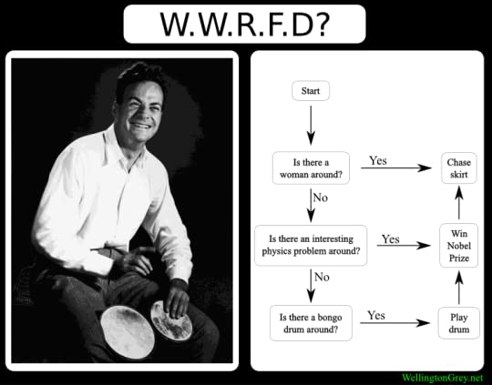

# 🚀 Summary

This is a collection of personal anecdotes by Feynman. He's lived a rather colorful life. He is brilliant, is well-traveled, experienced different cultures, experienced a war-time USA- all of which alone would have made a wonderful memoir. It covers his life right from childhood. There are chapters where he talk's about the peculiar English-ness at Princeton, the anxiousness at his first seminar that had Einstein in the audience, his experience working  on the Manhattan Project at Los Alamos, his travels to Brazil and Japan and how he loved to immerse himself in different cultures. There are chapters about education. One is about the standard of education is Brazil and the other is his experience serving on the panel to review school text books.     

He is also a showman. He recounts his knack for playing the bongos, learning and speaking Portuguese, cracking the uncrackable safes that supposedly held nuclear secrets of national importance- but no big deal-, being a ladies' man (for lack of a better term), drawing, and odd talents like these that kept him the life of the party.

The word _'curious'_ in the subtitle really works two ways. He held an inspiring curiosity for all things and Feynman was a curious fellow himself.

# 🎨 Impressions

> 
> What Would Richard Feynamn Do? (WWRFD)

This was a delightful read. I listened to the audiobook which was very well produced and accentuated the sarcasm and annoyance in Feynman's narrative. Very entertaining indeed!
Sure Feynman was a genius, he won the Nobel Prize after all. He was also charmingly boyish and downright mischievous. Themes that seem to be constant throughout his book. He might come across as self-aggrandizing and narcissistic if you take the book too seriously. I almost fell for that trap myself. Then the title reminded me that you can't take things too seriously.

A big theme of Feynman's life is his dismissal for formalities, societal views or rituals. All of which led to him nearly not accepting the Nobel Prize. To him this was a form of nonsense and he had already been rewarded when other scientists used his findings. 

His spirit of curiosity and inquiry is truly inspiring. Not only does this translate into his approach to learning but more notably it translated into how he taught others to think. The inspiring gift of how to think is perhaps almost as significant as any of his contributions in physics.

# 🕵 How I Discovered It

It was on the bookshelves of most people I admire.

# ✍️ My Favorite Quotes

> “You have no responsibility to live up to what other people think you ought to accomplish. I have no responsibility to be like they expect me to be. It's their mistake, not my failing.”

> “I didn't want to do the drumming if I was doing it because as Samuel Johnson said "If you see a dog walking on his hind legs, it's not so much that he does it well as that he does it at all".”

> “The first principle is that you must not fool yourself—and you are the easiest person to fool. So you have to be very careful about that.”

> “You see, I get so much fun out of thinking that I don’t want to destroy this pleasant machine that makes life such a big kick.”
