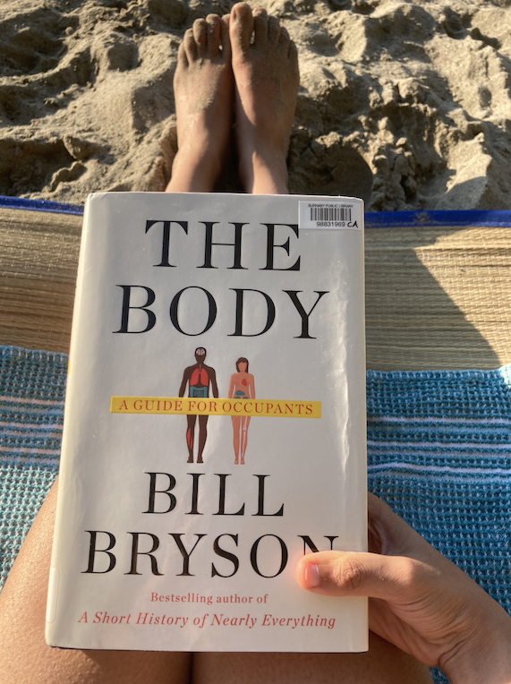

# 🚀 Summary
Bill Bryson takes readers on a tour of the human body. The book opens up with a discussion on how much it would cost to put together a human being from the chemical and compounds. Turns out putting the parts together is complicated and very expensive. Bryson isn't a scientist, he is a journalist and author who has done his research and presented his findings on the human body in an approachable and entertaining manner. Bryson's son is a doctor and that sort of compelled Bryson to write this type of book that knowledge and understanding of the human body accessible for non-experts. And that is where I think this book wins. 

# 🎨 Impressions
This was my first Bill Bryson book. His style is entertaining and I enjoyed his british sense of humor. He spares you a giggle and a chuckle every now and then. In one of my favorite lines Bryson calls the body 'our long suffering servants'.

The book was quite long so I took my time between chapters to ponder and reflect. Every chapter dives into a system or organ of the human body. And he takes liberal detours to keep the readed amused. I appreciate the depth of research Byrson had to conduct to produce a text that felt complete without being overwhelming. The book is replete with so many interesting fun facts that I felt compelled to share with family and friends. 

Bryson pays respect to the scientist and doctors who have been forgotten or more often that not never been recognized for their discoveries that enable us to live longer, healthier, and significantly pain free lives than at any other time in history. He includes his discussions with practicing scientits and doctors and makes very frequent references to Daniel Lieberman's The Story of the Human Body.

The most striking takeaway for me is that as a collective human race we have never at any other point in time had it as good as we do right now. Every few pages Bryson talks about how a situation or disease was handled historically and every time I am reminded of how fortunate we are today. Reading about how there was no concept of hygiene in an operating room or how a mastectomy was performed in the seventeenth century makes me extremely grateful to be alive at this time. The book has a couple of depictions and illustrations of such prodecures in the 1500s-1800s. The last few chapters are about medicine, cancer, mortality, and the real point of this book- figuring out to live a good and healthy life.

# 🕵 How I Discovered It
I used to be more aware of what I was eating, in high school I played a game with myself where I imagined my stomach was a huge cauldron and I was the witch in charge of deciding the next ingredient to go in. And if the ingredient seemed like it was a bad idea I'd pass. I've always been interested in the human body. When I was in high school I remember truly appreciating the things our bodies enable us to do thanks to all those biology textbooks. It astounded me how our hearts beat untiringly for some 80 years. Lately I've lost a bit of that awe and this book seemed perfect to get re-acquantied with the human body. 

# ✍️ My Favorite Quotes
>“Just being kind, for instance. A study in New Zealand of diabetic patients in 2016 found that the proportion suffering severe complications was 40 per cent lower among patients treated by doctors rated high for compassion. As one observer put it, that is ‘comparable to the benefits seen with the most intensive medical therapy for diabetes’.”

>“We have body clocks not just in the brain but all over—in our pancreas, liver, heart, kidneys, fatty tissue, muscle, virtually everywhere—and these operate to their own timetables, dictating when hormones are released or organs are busiest or most relaxed. Your reflexes, for instance, are at their sharpest in mid-afternoon, while blood pressure peaks toward evening. Men tend to pump more testosterone early in the morning than later in the day.”

>“The most universal expression of all is a smile, which is rather a nice thought. No society has ever been found that doesn’t respond to smiles in the same way. True smiles are brief—between two-thirds of a second and four seconds. That’s why a held smile begins to look menacing. A true smile is the one expression that we cannot fake. As the French anatomist G.-B. Duchenne de Boulogne noticed as long ago as 1862, a genuine, spontaneous smile involves the contraction of the orbicularis oculi muscle in each eye, and we have no independent control over those muscles. You can make your mouth smile, but you can’t make your eyes sparkle with feigned joy.”

>“Race is one millimeter deep. Intrepidly attending the dissection of a corpse", Bryson quotes the surgeon who pulled back a minute layer of skin and said: “That’s all that race is – a sliver of epidermis.” As we spread across the world, some people are thought to have evolved lighter skin in order to glean vitamin D from weaker sunlight. Throughout human history, people have “de-pigmented” and “re-pigmented” to suit their environment.
Biologically, skin colour is just “a reaction to sunlight”, Bryson quotes the anthropologist Nina Jablonski as saying. She adds: “And yet look how many people have been enslaved or hated or lynched or deprived of fundamental rights through history because of the colour of their skin.”

>“Where America really differs from other countries is in the colossal costs of its health care. An angiogram, a survey by The New York Times found, costs an average of $914 in the United States, $35 in Canada. Insulin costs about six times as much in America as it does in Europe. The average hip replacement costs $40,364 in America, almost six times the cost in Spain, while an MRI scan in the United States is, at $1,121, four times more than in the Netherlands. The entire system is notoriously unwieldy and cost-heavy. America has about 800,000 practicing physicians but needs twice that number of people to administer its payments system. The inescapable conclusion is that higher spending in America doesn’t necessarily result in better medicine, just higher costs.”

>“Bowel transit time, as it is known in the trade, is a very personal thing and varies widely between individuals, and in fact within individuals depending on how active they are on a given day and what and how much they have been eating. Men and women evince a surprising amount of difference in this regard. For a man, the average journey time from mouth to anus is fifty-five hours. For a woman, typically, it is more like seventy-two. Food lingers inside a woman for nearly a full day longer, with what consequences, if any, we do not know.
Roughly speaking, however, each meal you eat spends about four to six hours in the stomach, a further six to eight hours in the small intestine, where all that is nutritious (or fattening) is stripped away and dispatched to the rest of the body to be used or, alas, stored, and up to three days in the colon, which is essentially a large fermentation tank where billions and billions of bacteria pick over whatever the rest of the intestines couldn’t manage—fiber mostly. That’s why you are constantly told to eat more fiber: because it keeps your gut microbes happy and at the same time, for reasons not well understood, reduces the risk of heart disease, diabetes, bowel cancer, and indeed death of all types.”