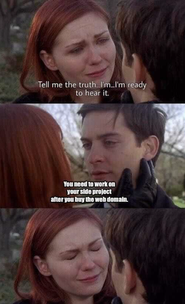

I've always wanted to have a personal website. All the important and cool people have one and I wanted to be part of that club. Plus I was itching to work on a side project during the pandemic in 2020. I also had a discount for a domain name (from a Hackathon) that I had used to register 'rhearodrigues.me'. 

And so during the pandemic last year I got serious. I looked into popular frameworks and which one would be best for me. In addition to the usual suspects like WordPress, Squarespace, Wix, and Jekyll I came across Gatsby JS. To decide I listed my requirements: 
1. I wanted to use my own domain name.
2. It has to be simple. Simplicity means two things actually. First, the learning curve must be gradual to keep me motivated. And secondly, simple in terms of the aesthetic look I wanted it to feel light and minimal. I cared about the design but I wanted to focus attention on the content versus the design.
3. Popular- for support from the developer community.
4. Long-term- I will be putting in the time and effort to build this website so the last thing I want is to migrate to a new framework. Ideally, I would _never_ want to migrate.

After a lot of research and stalking cool blogs on the internet to identify their technology using [Wappalyzer](https://www.wappalyzer.com/) it was time to make a decision. I used the process of elimination and Gatsby JS was the winner by a strech. WordPress, Squarespace, and Wix were not simple and light enough. Sure they were popular, but I didn't see myself using it in the long-term. More downsides were that these were not free, not open-source (except WordPress) and did not have any real learning curve. Jekyll was to simple for my liking- not a lot of wiggle room to tweak and customize themes, it has been around for a long-time which means good community support but I didn't see myself sticking to Jekyll long-term. 

When I was lurking the internet it quickly became clear that [several](https://www.youtube.com/watch?v=L3Un8Zp4r6k) [smart](https://www.taniarascia.com/migrating-from-wordpress-to-gatsby/) [arguments](https://www.jerriepelser.com/blog/migrating-blog-hugo-to-gatsby) made the case in favour of Gatsby.

Gatsby JS was a clear winner. It was simple- not too steep of a learning-curve and more than enough room to tinker around with customizations. It was very popular, in fact the community surrounding Gatsby drew me in with their support and enthusiasm. Their branding really reeled me in- it seemed fresh,fast (and fun not overwhelming or boring like other frameworks). Finally, I could see myself using Gatsby JS in the long run, being fairly new and having a active community was a good sign. 

So I started reading blogs, docs, watching tutorials and building this website with [Gatsby JS](https://www.gatsbyjs.com/). I'm no web development expert and the great thing is that you don't have to be one to build your own website. I think it would be nice to tell you what I've learned about Gatsby and my reasons for using it to build this website. Hopefully, reading it will help you make sense of and build a picture of what it is. 

### A little bit about Gatsby

In essence *Gatsby is a React application.* Think JavaScript library for building a website's UI/front-end.

Gatsby serves two broad use cases. 
1. First, you can use it as a *static site generator*. Think Jekyll, a personal portfolio site, or a blog like this. 
2. Second, you can use it to *build dynamic web applications*. Think Twitter or e-commerce sites i.e. websites that fetch dynamic data, support client-side JavaScript and authentication for example. 

It happens to be an excellent tool for both use cases.

### More reasons why Gatsby is really cool

1. **Gatsby makes websites fast.** Here, 'fast' refers to, fast for the developers to build and also fast in terms of performance for the end-user experience.

2. **Gatsby has a rich plugin ecosystem.** Or in other words it is possible to add features to your web app in a plug-and-play manner. Basically, you can do a lot of customization with very little code.) 

3. **Gatsby builds are quick.** It uses optimizations to speed up the build and deploy process. The Gatsby website claims the build and deploy process is "2.5x faster than other static frameworks". This is extremely cool! Even though a light-weight personal website like this would see microscopic benefits in this regard.

4. **Hit the ground running with "starters".** Starters are boilerplate Gatsby sites. So I could pick a bare-bones template site and could add style and customization as needed.
This was important to keep me motivated and avoid getting lost in the labyrinth of learning a new web development framework.

5. **Learn React as I go along.** I have followed the odd React app tutorial many times to learn React. This would wnd half way because these were not projects I was commited to. Building my website with Gatsby presented a great oppurtunity to learn React and see it through especially with Gatsby's clear, easy-to-follow docs and a active supportive community!

###  TL;DR
All this was to say two things. One, Gatsby is a great framework that lets you do important things fast. Second, this website of mine is now powered by Gatsby! 

Did the thought of setting up your own website cross your mind? Or you don't like something about your current website? Maybe I've convinced you to build your website with Gatsby? I hope I did. Here are some of the best and most helpful resources that helped me.

### Resources

1. [Creating a Blog with Gatsby](https://www.gatsbyjs.com/blog/2017-07-19-creating-a-blog-with-gatsby/)

This one's from the Gatsby Blog, it was published in 2019 so there might be newer features but I think the basics stay the same so it's a great start. Don't be discouraged by the length of this tutorial, take a couple of days to go through it and things will make more sense when you watch/read other tutorials to actually set up your website-blog. Sidenote: it's written by Dustin Schau who I've found conveys ideas simply and logically. 

2. At this point you might want to start reading these from the offical Gastby docs:
   - [Introduction](https://www.gatsbyjs.com/docs/)
   - [Gatsby Project Structure](https://www.gatsbyjs.com/docs/reference/gatsby-project-structure/)
   - [Sourcing Content and Data](https://www.gatsbyjs.com/docs/content-and-data/)
   - [Building with Components](https://www.gatsbyjs.com/docs/conceptual/building-with-components/#page-template-components)

3.  [How To Build A Portfolio With Gatsby — From Scratch To Deployment](https://konstantinmuenster.medium.com/how-to-build-a-portfolio-with-gatsby-from-scratch-to-deployment-cacbf7a1527)

This is another long post on Medium that goes through all the steps it takes to build your website. Again take your time to go through and understand the project folder structure, plug-ins, markdown files, etc . The last step is deploying with Netlify but you can easily swap that with hosting with GitHub Pages.  

4. Some more good reads:
    - [Introduction to Gatsby](https://flaviocopes.com/gatsby/)
    - [Sorting out the Gatsby folder structure for my blog](https://www.jerriepelser.com/blog/sorting-out-gatsby-folder-structure/)
    - [Hosting With GitHub Pages](https://missrhea.github.io/Hosting-With-GitHub-Pages/)
    - [Continuous Deployment With GitHub Actions](https://missrhea.github.io/Continuous-Deployment-With-GitHub-Actions/)
    - [Google Analytics For Gatsby!](https://missrhea.github.io/Google-Analytics-For-Gatsby/)