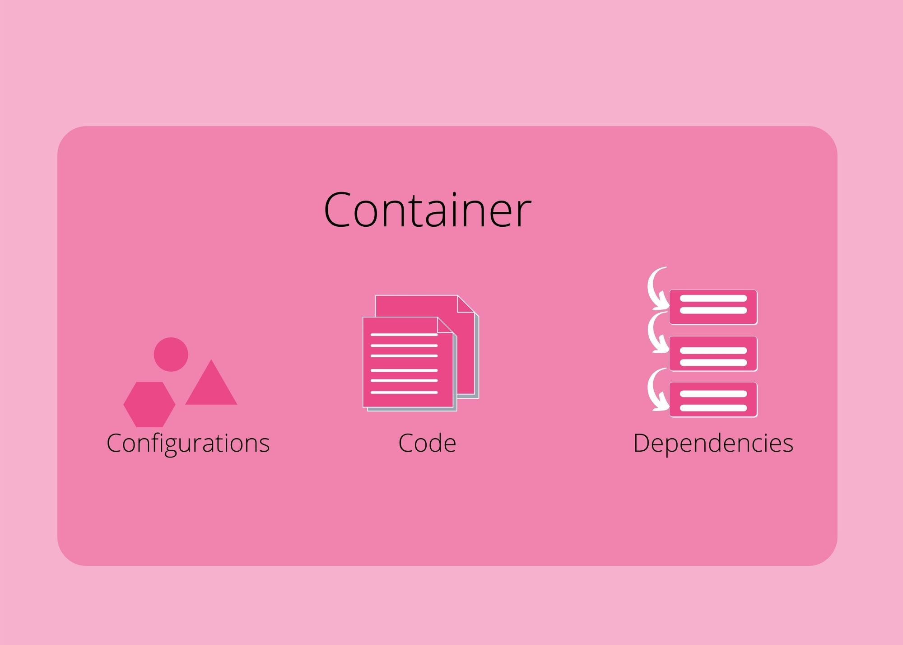

<markdown>

What is Docker? Before I can tell you what Docker is, I have to tell you what a 'container' is. Because Docker is just a tool (among many others) that enables a technology called 'containers'.

A **container is a package**. This package is made of the application (being developed) along with all the necessary **dependencies and configurations**. This package is **portable** just like any other [artifact](https://softwareengineering.stackexchange.com/a/106474) created during development. Just like code lives in a repository (like in GitHub, which may be public or private), containers (more accurately, container images) live in a **container repository** (like on DockerHub, which may be public or private). This **packaging and portability** offered by containers make development and deployment much more efficient. Let's look at how this is possible.

# How containers improve the development process

In the past without containers, each developer would have to install, configure and run the necessary binaries for local application development. Different versions of the local OS and dependencies give rise to a lot of variability in setting up the local development environment. This variability leads to complexity and more room for errors. 

Container technology **eliminates this complexity**. A container serves as an **isolated OS or a stand-alone environment**. This enables developers across the team to simply download and run the packaged container (image) for the application they are working on. Now each developer has a local development environment (along with all the necessary configurations and dependencies) that is **consistent** across the team. 

Containers significantly **reduce the friction** to set up a local environment and get started on development. Containers also make it possible to run multiple different versions of the same application at the same time **without conflict**. Each version runs in its isolated container.

# How containers improve the deployment process

Again, in the past without containers, the development team produced artifacts including instructions for set-up and configurations on the server. Then the operations team would follow those instructions to deploy the application, add configurations and install dependencies directly on the host server in production. Many issues can arise from this approach, but here are two time-consuming issues.

* **Misunderstanding between teams**

    The development team communicates (usually via text documents) set-up instructions to the operations team. The nature of human communication can lead to inefficient back and forth before the ideal application set-up is deployed on the production server.

* **Dependency version conflict**

    Several configurations and dependencies exist directly on the same production server. For example, in the case of two different services deployed on the same server, a conflict can arise if the two services require different versions of a dependency. Ideally, we want to run multiple services on the same server to maximize throughput. Yet the potential for conflict on a production server used in this manner is high.

The common theme among these issues is that they introduce room for human error. Pretty much everyone is prone to make errors. We're human at the end of the day. Containers eliminate the need to perform the steps that lead to these errors. In other words, containers eliminate the room for human error. And ultimately make the deployment process much more efficient. 

* The misunderstanding between teams is eliminated because there are no instructions to be communicated. The packaged application container (image) produced by the development team can be handed over to the operations team to be deployed directly on the production server. 

* With containers, each application/service is running in its isolated environment. This eliminates conflicts because no application-specific set-up is required directly on the host server. All application-specific requirements live within the container. The only requirement for containers to run on the host server is to set up a container run-time environment on the server (that can run multiple containers).

These are a few reasons how containers improve the experience of building software which makes it a technology worth learning about. And Docker is just one manifestation (albeit extremely popular) of containerization technology to easily develop, deploy and run applications.

> *To summarize in one sentence, Docker is a containerization technology where a container is a packaged application (along with the necessary dependencies and configurations) that is portable and increases the efficiency of building software.*

</markdown>