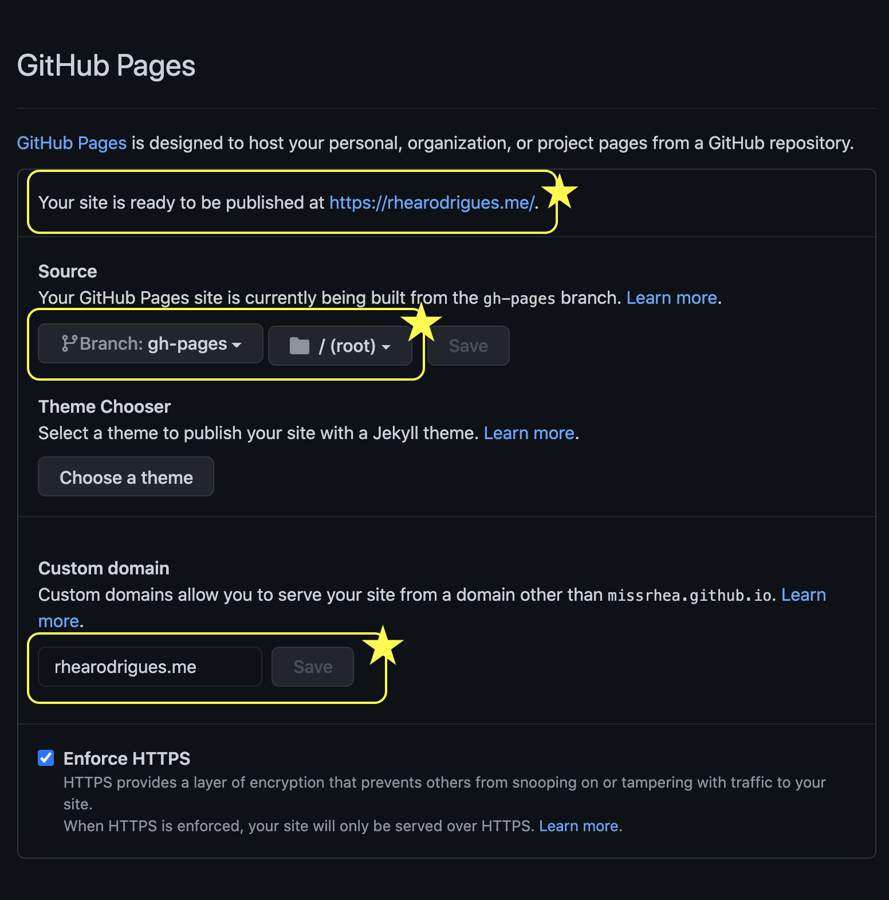
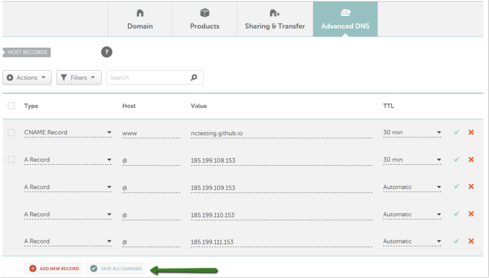

I registered for a custom domain name for my website on [NameCheap.com](http://NameCheap.com). Without a custom domain name my GitHub Pages website would have been hosted at missrhea.github.io (i.e. \<your-username>.github.io). This did not bother me, I just wanted to try a custom domain name for fun plus it was free.

### **1. Configuring the custom domain name on GitHub**

Inside the missrhea.github.io repository, click on the Settings tab. Scroll down to the GitHub Pages section. I entered my custom domain name in the "Custom domain" field and saved that.

The above step created a commit that added a CNAME file to the root of my publishing source i.e. the root directory of the `gh-pages` branch.

### **2. Configuring the custom domain name on NameCheap.com**

On [NameCheap.com](http://NameCheap.com) I created the following records under the Advanced DNS tab,

-   A CNAME record to point [rhearodrigues.me](http://rhearodrigues.me) (i.e. my custom domain) to [missrhea.github.io](http://missrhea.github.io) (i.e. the default domain of my GitHub Pages website).
-   Four A Records (with Host as "@" i.e. root) for the *Github A Record IPs*: 
	- 185.199.108.153 
	- 185.199.109.153 
	- 185.199.110.153 
	- 185.199.111.153

Now my website hosted using GitHub Pages is available at rhearodrigues.me!

## References

- GitHub Docs [here](https://docs.github.com/en/github/working-with-github-pages/managing-a-custom-domain-for-your-github-pages-site).

- NameCheap.com support page [here](https://www.namecheap.com/support/knowledgebase/article.aspx/9645/2208/how-do-i-link-my-domain-to-github-pages/).

