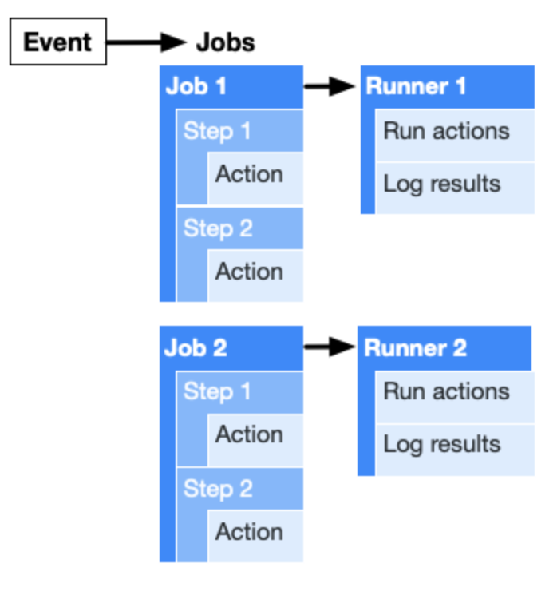
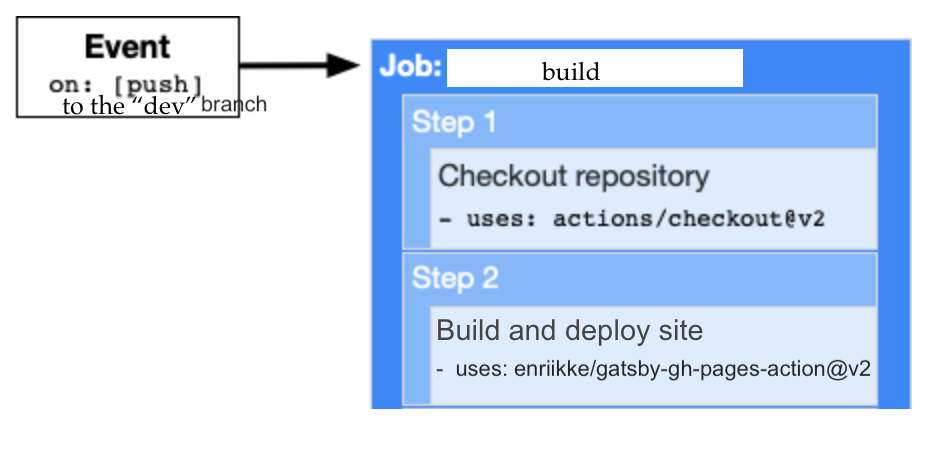

In this [post](https://rhearodrigues.me/Hosting-With-GitHub-Pages/) I explained how I deployed my website using a simple deploy script. 

There is another method to do this same thing but with continuous delivery. It uses GitHub's new feature called GitHub Actions. It is obviously not necessary for my personal website. However I think it's pretty cool to have a personal website with continuous delivery!

## Enter GitHub Actions

As I was scouring the internet to figure out how to host my Gatsby site on GitHub Pages I came across GitHub Actions as a CI/CD server. I thought figuring out how CI/CD works and what GitHub Actions is by setting it up for my website would be pretty cool.

From all the reading I've done, if I had to describe what GitHub Actions does in one word I'd say **automation**. 

Put simply, a GitHub Action defines a _workflow_ to perform some task. This _workflow_ will be automatically triggered each time a specified _event_ occurs. 

The [docs](https://docs.github.com/en/actions/learn-github-actions/introduction-to-github-actions#the-components-of-github-actions) define the following components that make up a GitHub Action,

- **Actions:** are the smallest building block of a workflow, an action is any standalone command.

- **Steps:** performs a single task, a step is made up of a single action.

- **Jobs:** are made up of one or more steps that execute on the same runner.

- **Runner:** is a server that listens for jobs, runs one job at a time, reports progress, logs results back to GitHub.

- **Workflow:** is made up of one or more jobs. A workflow with multiple jobs will run those jobs in parallel (default) or sequentially.

- **Event:** a specific activity (for example a new pull request) which triggers a workflow.

Before I explain the workflow I require, let me give you some context. I'm developing locally on the `dev`  branch and the remote `gh-pages` branch is the publishing source for my GitHub Pages website.

So the workflow I need for my website would look like this,

Whenever I push to the `dev` branch, the **"build" job** will be executed. This job has **two steps**. 
- First step will checkout the repository to a **runner** (i.e. a linux virtual machine server) on which the code can be executed.
 
- Second step will create the build and push it to the `gh-pages` branch.

For the second step, [this](https://github.com/enriikke/gatsby-gh-pages-action) community action on GitHub Marketplace does exactly what I need. Think of GitHub Marketplace as a open source library for GitHub Actions- this means a kind person wrote and open-sourced step two for me.

I modified the community action to work with my website. In particular I configured the access token and the source branch. The **workflow** is defined inside the `./github/workflows/main.yml` file. This is my workflow definition, 

`gist:missrhea/0c2580ccea6ad5621a9dd72646ffd90a`

And we're done! Now each time I run the `git push` command the workflow will be triggered and a new version of my website will be deployed automatically!
