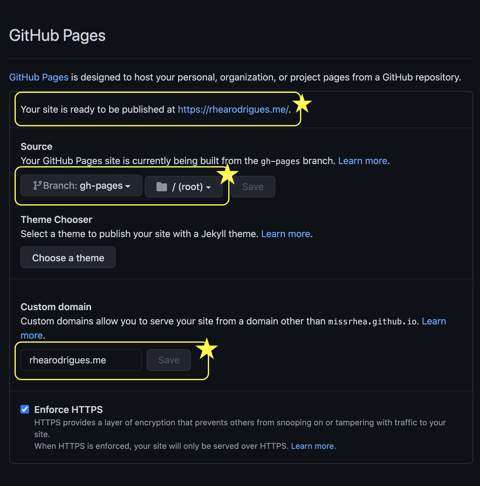

<style>
code{
    color:#E9BC3E
}
</style>


In the last post I mentioned, I'm building this website with Gatsby and explained why. So far I have a working version of my Gatsby site locally. In this post, I'll go through the steps to host this site using GitHub Pages.

**1. Create a new repository named  \<your-username>.github.io**
GitHub Pages will host my website at missrhea.github.io from the missrhea.github.io (i.e. \<your-username>.github.io) repository. That means the files needed to host my website must be inside this repository. 

**2. Create a new branch called `gh-pages`**
Create a new branch and name it `gh-pages`- don't change the name since the gh-pages package in step 4 requires this.

**3. Set  `gh-pages` as the publishing source**
In the Setting tab for this repository under the GitHub Pages section, set the Source as this `gh-pages` branch. So the website will be published from the `gh-pages` branch, and not from the default "master" branch. 

>

Here is the explaination for not using the `master` branch as the publishing source for the website. 
- When the build for the website is created using the `gatsby build` command, Gatsby will build everything needed to deploy the static website. This build will include the static HTML pages, JSON files, transformed images, markdown files. These files are placed in the `./public` directory and it looks very messy. 
- However, the publishing source for my GitHub Pages website must be able to read the contents in the `./public` directory. To avoid this clutter on the default `master` branch  I prefer to have these files on another branch.


**4. Build and push to the remote  `gh-pages` branch**
I'm developing the code for my website locally in the `dev` branch. Right now the `gh-pages` remote branch is empty. As it is the source branch, `gh-pages` should ideally contain all the files generated by the `gatsby build` command. 

This can be achieved with a simple deploy script in the `package.json` file. The script to do this involves two commands.

-   `$ gatsby build` 
**This command will create the build.** When the build process is complete all the files necessary to deploy the website will be present in the `/public` directory.
    
- `$ gh-pages -d public`
**This command will push the contents of the `./public` directory to the remote `gh-pages` branch.** Then Github Pages will publish the contents of this branch. 

The Gatsby docs outline the steps using the gh-pages package in detail [here](https://www.gatsbyjs.com/docs/how-to/previews-deploys-hosting/how-gatsby-works-with-github-pages/#installing-the-gh-pages-package). This is why I named the source branch `gh-pages`. Because the gh-pages package requires this name.

Install the gh-pages package with,

```$ npm install gh-pages --save-dev```

Now put these two commands together in a deploy script in the `package.json` file.

```
{
 "scripts": {
  		"deploy": "gatsby build && gh-pages -d public"
 	}
}
```
Execute this deploy script with `$ npm run deploy`. This will build the site and push the contents of the `./public` directory to the (remote) `gh-pages` branch.

Voilà: each time I want to update my website or publish a new post all I have to do is run the `$ npm run deploy` command!