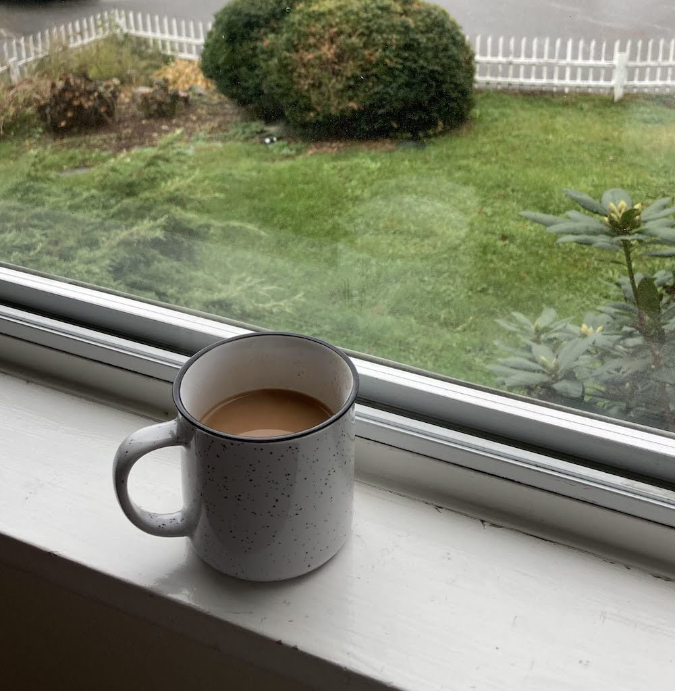

 This is a post about how I make my Chai every morning. I prepare my tea so that it has a strong flavor. This means boiling the tea leaves for a little longer than required. To balance out the intense flavor I suggest using whole milk. This works best with loose leaf black tea (I like a couple of Indian brands I prefer) and grated ginger. If I’m feeling fancy I might add a couple of other spices.

## Ingredients
- ½ cup water
- ½ cup milk
- 1 Tbsp loose leaf black tea
- ½ Tbsp grated ginger (for a less intense 
ginger flavor, slice instead of grating)
- 2 green cardamom pods
- cinnamon stick/ lemon grass stalk / a bay leaf
- (Optional) Preferred sweetener to taste

## Instructions
1. To a saucepan add crushed spices, water, and grated (or sliced) ginger and bring to a boil over high heat. Then reduce heat slightly to medium.
2. Add tea and milk of choice and lower heat to low. Cover and continue to simmer for 5 minutes to allow the flavors to combine.
3. Then turn off the heat. Pass through a strainer and add your sweetener before serving.

Chai on a stormy day is a big mood and I hope you try if you haven’t. Unlike wine you really can’t go wrong with pairing chai with almost anything- sweet or savoury. 