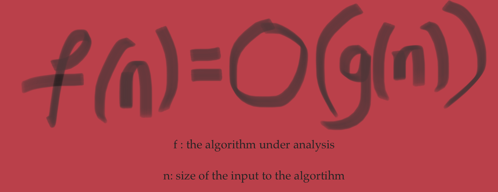
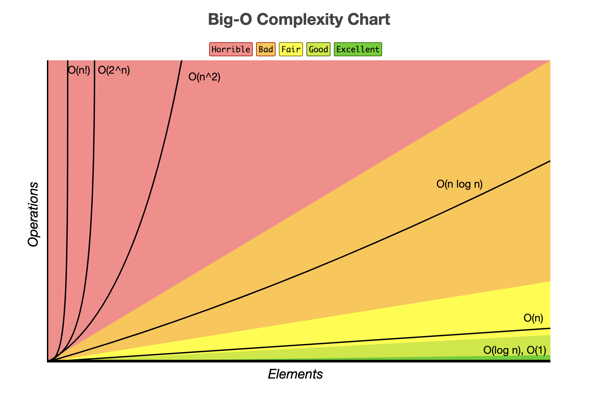

Knowing how complicated a task is will be an important factor in deciding whether the task is worth doing to achieve some outcome. Similarly, knowing how complicated an algorithm is will be a strong indicator of whether to use it or not to achieve some outcome. In our day-to-day life, we might decide how complex a task is based on how much time it will take, how far do I have to travel, do I have the money and resources for this task, etc. How do we decide how complex an algorithm is? We use the Big O Notation for that. 

# Enter The Big O Notation

Firstly, the Big O notation is just a notation. Don't be confused by the parenthesis that makes it read like a function. The O stands for "order of". Think of it as a label attached to an algorithm to describe how fast the algorithm grows.

In the Big O Notation, the function 'f' is the algorithm we are analyzing. And the input 'n' is the size of the input to the algorithm 'f'. Now we have a framework to compare different algorithms 'f' as a function of the input size 'n'.

The Big O Notation gives us an idea of how complex an algorithm is, so we can compare different algorithms. When we say 'complexity of an algorithm' it refers to complexity with respect to any finite resource- time, memory, network input/output, etc. If you think about it any finite resource ties back to time- which is the ultimate finite resource.

# More Formally,
Think of f(n) and g(n) as the running times of two algorithms on inputs of size n.

Suppose f(n) and g(n) are two functions from positive integers to positive reals. We write f(n) = O(g(n)) for n -> ∞ if and only if there exist constants N and C such that, |f(n)| <= C |g(n)| for all n>N.

# More Intuitively,
f = O(g) means that **f does not grow faster than g**.

Saying "f=O(g)" is like saying "f <= g". Similarly, the are analogy for '>=' and '=' are the Big Omega and Big Theta notations respectively.

**Big O**: f=O(g) means f<=C*g(n) for n>N

**Big Omega**: f=Ω(g) means g=O(f)

**Big Theta**: f=Θ(g) means f=O(g) and f=Ω(g)

# Abstracting away the implementation details
When we program an algorithm and actually run it on a computer, it is very difficult to determine the exact number of instructions or machine cycles that will be executed by the processor. Looking at the source code does not help. This is because there are too many external factors like hardware, software, and programming-language specifics that affect the actual time (in seconds) for a program to run.

We can abstract away from these implementation specifics to simplify how we reason about an algorithm's complexity. So we express the algorithm's running time in terms of the basic computer steps.

Say an algorithm has 5n2+10n+3 basic steps on an input of size n. So the running time can be expressed as a function of the input size i.e. f(n)=5n2+10n+3. As n -> ∞ the highest order term will determine the rate of growth of the algorithm's run time. So the lower order terms and coefficients become negligible. We can say, that f=O(n^2), said as "f is big oh of n square".

>### Question
> **f(n) = O( f(n)2)**

>Decide whether it is always true, never true, or sometimes true for asymptotically nonnegative functions f and g. If it is always true or never true, explain why. If it is sometimes true, give one example for which it is true, and one for which it is false.
>### Answer
>Sometimes true. example: f(n)=n and counterexample: f(n) = 1/n.

# Some Perspective

Assume we have a budget of one week and one operation requires 1 millisecond. Now, one week has 604,800,000 milliseconds. That is approximately 604 Million milliseconds. Let's say we have a bunch of different tasks that require different algorithms.

For instance, a linear search task with O(n) time complexity and a sorting task with a worst-case complexity of O(n2). We still have only one week and the same processing power for any algorithmic task. The maximum input size that can be processed by any algorithm in a week is shown in the following table.  

|Algorithm|Time Complexity|Maximum Objects Best Processed  |
|--|--|--|
| Linear Search| O(n) | 604 Million |
| Sorting| O(nlogn) | 604 Million |
| Sorting worst-case| O(n2) | 25,000 |
| Set cover| O(2n) | 29 |

To elaborate, let's consider the set cover task. Don't worry about the details of the set cover problem now, just know that it has a time complexity of O(2n). In a week we have approximately 604 Million milliseconds of processing power. So we ask, "what is the largest n for which 2n in within the 604 Million millisecond mark?". The answer to that question is, 

n = log(604,800,000) = 29

In a week we can only solve the set cover problem for an input size of n = 29. Such is the curse of exponential time complexity. 

In conclusion, we reason about an algorithm's complexity using the Big O notation. And the order of the algorithm's complexity determines how your task will slow down as your data grows.

# References
* [Big O Cheat Sheet](https://www.bigocheatsheet.com/)
* YouTube video from which I stole this post's title is [here](https://www.youtube.com/watch?v=duvZ-2UK0fc)

