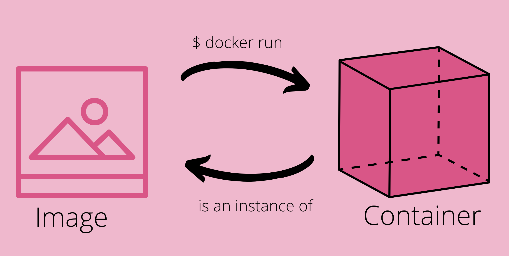

<style>
body {
text-align: justify
}
</style>
In the previous post, [Building Software Better With Docker](/Building-Software-Better-With-Docker/) I introduced Docker, defined containers, and how it can improve the software development process. I wrote that post to provide a mental model for the concept of containers and motivate their use. Here I want to talk about the technicalities of containers.

# Image vs Instance


A container is a running instance of an image. We refer to the image simply as the 'image' and the corresponding running instance is referred to as the 'container'.

| Image | Container|
|--|--|
|The portable artifact| The isolated OS environment|
| The packaged application with all dependencies and configurations | The running instance with the application running inside it|


# Image
Conceptually an image is a stack of other images layered on top of each other, such that an image layer depends on the image layers below it. 

The **bottom-most image layer** is called the **base image**. It is usually a small size Linux distribution OS like Alpine. The small size ensures the size of the overall container image stays small. 

The **topmost image layer** is the one with the actual **application**. The intermediate layers are images that support the actual application. The necessary dependencies or run-times that support the main application layer above are intermediate layers.

# Container
A container is the **running OS environment** created when its corresponding image is executed. But how is this **running OS environment** different from what a VM provides? I explore that difference [here](). In short, a container and a VM are both virtualization tools but they virtualize different parts of the OS. The advantages of using a container over a VM include smaller size, faster speed, and wider compatibility.

To use an OOP analogy, the image is to a container what a class is to an object (i.e. the instance at runtime). With Docker we can use the following command to start a container from a image named IMAGE.

``` $ docker run IMAGE```