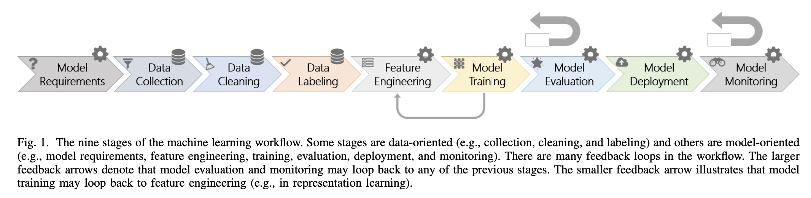
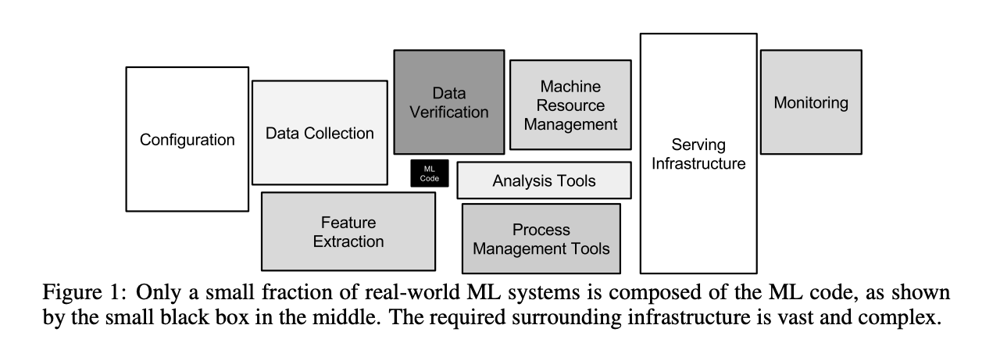

 > This article discusses how Data Science efforts must include deployment of models, challenges associated with it, and in particular reproducibility- what it means and how we can measure it. 

Let’s say that you just pushed a high-performing model to production. You’re done, right?

No, not really. This is just the beginning.

Most literature talks about the **offline stage** of a data science project, which includes:

1. Problem Definition  
2. EDA  
3. Data Cleaning  
4. Modeling  
5. Performance Evaluation

But, the literature rarely mentions the **online** stage of a data science project, which includes:

6. Productionizing  
7. Maintenance  
8. Adoption

A model that proved itself offline will not necessarily work as excepted online. It needs to be battle-tested with real-world data in production. In reality, in a Data Science modeling project, the effort doesn’t stop after the delivery of a model, a continuous effort is required for maintenance and adoption. So, when you plan a modeling project, don’t just plan for the offline stage, but also, online stage of a project.

> **A Data Scientist’s mandate is to deliver on their promise to add value to the business.**

To add value to the business, Data Science work must go beyond just training and tuning the best possible model. It must include model delivery i.e. deploying in production so the model’s predictions can be consumed. The customer or end-user should be able to consume the model’s outputs in whatever manner is convenient to them- in the form of dashboards, web applications, batch jobs, APIs, or daily reports in their inboxes. When the customer can reliably extract predictions from Machine Learning models then we get maximum value from the models.

Before diving into more detail, let's define some terms in the context of Data Science for clarity.

 - *Environment*
	 - The setting or state of a computer on which a software application/product is developed or put in operation. It includes the hardware, operating system, and software.
 - *Research Environment*
	 - The setting (tools, programs, libraries) suitable for data analysis, development, and evaluation of ML models. Might include python, pandas, jupyter notebooks, etc
 - *Production Environment*
	 - A *real-time* setting with execting programs and hardware setups that enable an organization's daily operations. ML models are served to clients to meet a business need.

 

## Machine Learning in Research vs Production

A quick glance at the different aspects of ML and their different concerns depending on whether we look at the research or production environment.

|Aspect  |Reseach  | Production |
|--|--|--|
| Objectives |Model performance  | Different stakeholders have different objectives |
| Computational priority | Fast training, high throughput | Fast inference, low latency |
|  Data | Static | Constantly shifting |
|Infrastructure planning|N/A|Yes|
|Running experiment|N/A|Possible|
|Concerns about scaling|Not important|Important|
| Fairness | Good to have (sadly) |  Important|
| Interpretability | Good to have  | Important |

 

## Challenges in Productionizing a Model

A Data Scientist might have perfected modeling in the research environment, but when it comes to deploying the model in a production environment there is a tendency to look the other way. To be fair, ML applications in industry are relatively new (compared to Software Development). Most people gain ML expertise through academia i.e. reading papers, taking courses, and research work. Which means little to no incentive for them to pay attention to productionizing a model. This is exactly where I was until I began working as a Data Scientist which was a reality check about how different ML in the industry was from my academic training.

The knowledge around productionizing models evolved in the industry since there was nowhere else to look for help. The practices involved in the online stage have been tried and tested by professionals in the industry. Today we can take advantage of their efforts, and learn the best practices to think about the ML system design for our projects. We can learn from examples like Uber that developed [Michaelangelo](https://eng.uber.com/michelangelo-machine-learning-platform/)- an ML-as-a-service platform to enable building and deploying ML solutions. As additional resources, these two papers by [Google](https://papers.nips.cc/paper/2015/file/86df7dcfd896fcaf2674f757a2463eba-Paper.pdf) and by [Microsoft](https://www.microsoft.com/en-us/research/uploads/prod/2019/03/amershi-icse-2019_Software_Engineering_for_Machine_Learning.pdf) are worth mentioning. These papers discuss end-to-end ML system design, risks associated with it, and best practices to address them. ( If you decide to read/glance through these examples, take the suggestions with a grain of salt- use it as a checklist and don't aim to achieve every single item, instead focus on what is most relevant to your problem.)

When it comes to traditional **Software Development in Production** a few common challenges are:

-   **Reliability**: Tolerating hardware/software/human errors.
-   **Reusability**: Ability to be used across systems and projects.
-   **Maintainability**: Operability, simplicity, and evolvability.
-   **Flexibility**: Ability to adapt to other newer components.
-   **Scalability**: Measuring load, performance, throughputs, and latency percentiles.

With deploying a ** ML model in Production** we face the above software development challenges and additional modeling specific challenges like:

-   **Reproducibility**: The ability to produce consistent results given the same data across systems. In other words, given the same input data, the model is production should be able to perform as well as the model in the research phase.

-   **Collaboration**: Data Science projects usually require collaboration from cross-functional teams. Data Scientists interact with Subject Matter Experts, Developers, Data Engineers, Business Executives.

-   **Discrepancy in Programming Language**: When the programming language used in the research environment is not the same as that in the production environment, rewriting the code increases the timeline to deploy. In addition, we also risk losing reproducibility.

> For example, Twitter is a Java shop- most of their production codebase is in Java / Scala (JVM languages). So they have to build a lot of production gluing logic, to make Tensorflow (C++ and Python-based) for Machine Learning projects work at Twitter. (Heard on [this](https://open.spotify.com/episode/0s032RWTHT2wVPUdd7cqZM?si=4QWPRX51SEm6eZjhMSQnwA&dl_branch=1) podcast with an ML Engineer at Twitter, skip to around the 20-minute mark).

 

## What I Talk About When I Talk About Deploying a Model 

When I talk about deploying an ML model I mean deploying the entire **ML pipeline**. That includes all the steps, right from the moment we accept the raw input data, followed by data cleaning, data preprocessing, feature engineering, and feature selection just before the data is passed onto the model. In the research environment, each step that touches the data needs to be applied to the raw input data in production i.e. the ML pipeline must be **"reproduced"** in the production environment. 

 

## Let's Talk About Reproducibility For a Moment
We want to reach the state such that if we gave the same raw input data to the ML pipeline in the research and production environment then we should receive the same output predictions from both. In that sense, the **ability** to **"reproduce"** the performance of the ML pipeline in production to be similar (or as close as possible) to the performance achieved in the research environment is **"reproducibility"**.

Obviously, you won't check individual predictions instead you will compare the overall **ML pipeline's performance**. In the research phase, the model is optimized for business value- measured according to pre-defined metrics (KPIs) like, 'increase in revenue'. Other metrics to evaluate performance might be precision, recall, F1 score, AUC ROC, etc depending on the nature of the problem. For **"reproducibility"** ensure that these metrics in production closely resemble those in the research phase.

When you ensure reproducibility you reduce certain risks- the risk of increased financial cost, delay in delivery, and damage to reputation when your model in production underperforms. 

---
Once the entire ML pipeline is deployed then raw input data can be used to either 
(a) extract predictions from the trained model or 
(b) re-train the model. 

Finally, Data Science efforts don't end with modeling.
Deploying ML systems isn't just about getting ML systems to the end-users. Just like concerns with software systems in production, it's about building an infrastructure so the team can be quickly alerted when something goes wrong, figure out what went wrong, test in production, roll-out/rollback updates.

