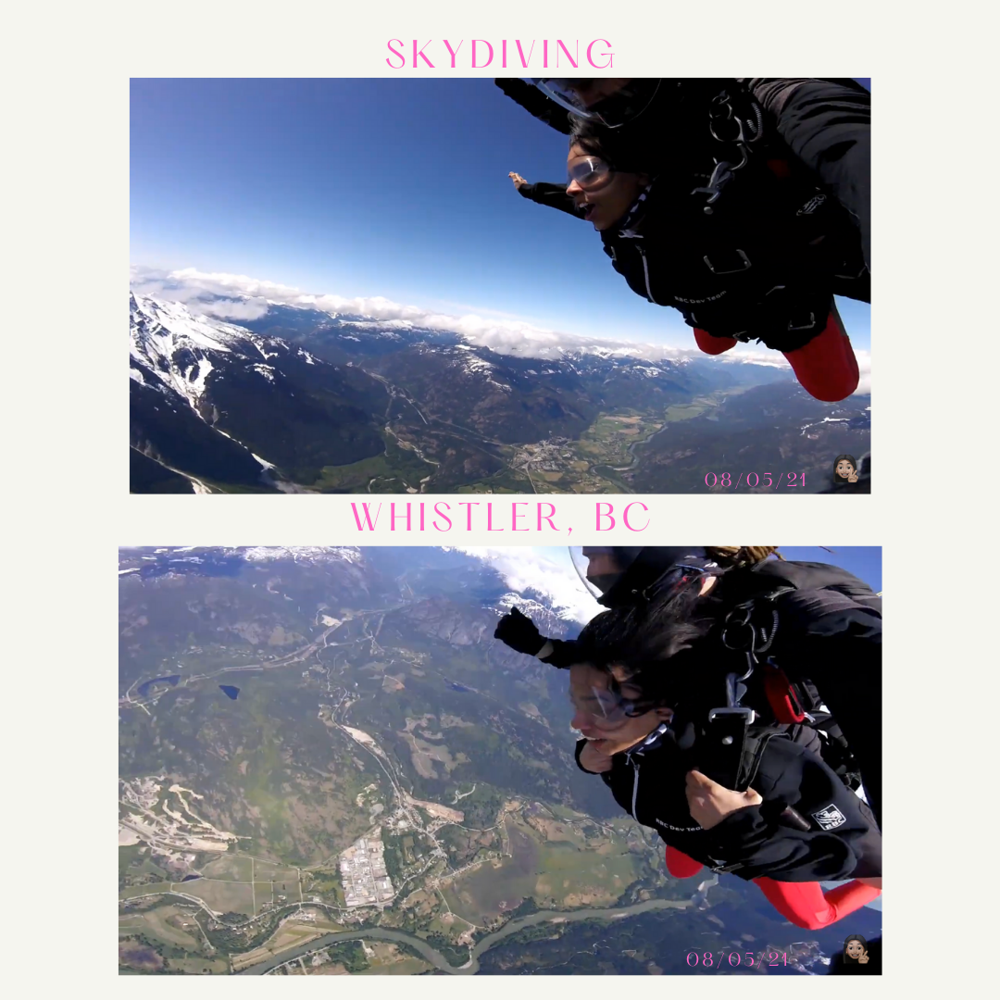

Today is Sunday and I'm in my room now, but only a few hours ago I jumped out of a plane 10,500 feet above the ground. It was unbelievable. I want to share my experience right from the time I booked the ticket to the moment I landed. And if you're somebody who's on the fence I hope I can inspire you to get on the thrilling side of that fence.

#### Tuesday Night
A friend, let's call him K, called me up and said "let's go skydiving". I was like "oh we should that sounds fun". Then K said let's go this weekend, and I was like "this weekend seems way too soon, I want some time to mentally prepare". I gave K lame excuses for why this weekend was too soon. That was that and I didn't hear from him for the next few days and I hoped he forgot about it or something came up.

When I called my mum I told her I might go skydiving and she was all for it. She told me to just do it now while I'm young. She had a good point, I might as well do it sooner rather than later. Although this weekend seemed way too soon.

#### Friday Night
At 10 PM K calls and says "we're going skydiving this weekend, do you want to go on Saturday or Sunday?" I gave a couple of lame excuses to squirm my way out of it. But we both knew I had no "real reason" not to go ahead and do the jump on Sunday. So it was decided. 

K booked the tickets for himself, his roommate, and me right then on the call. There was no backing out now, I owed K a pretty huge sum of money. In retrospect I'm glad K did the booking for all of us, I think I would have hesitated for a ridiculously long time before I clicked the 'BOOK NOW' button. 

Before I fell asleep that night, I read about skydiving experiences and watched a couple of youtube videos. It seemed like these people had exhilarating experiences, to say the least. When I closed my eyes and imagined myself in their shoes I felt my heart race. I was unable to sleep. I finally decided to not think about it. Which is tricky actually. Like, if I told you not to think about a pink elephant, you thought of a pink elephant, didn't you? 

 I came up with a couple of strategies for not thinking about 'it'. 
 - __Don't call 'it' by its name.__
 - __Tell myself it's too far away into the future to worry about.__ In fact, it is so far away that you might not even get to Sunday because of an Earthquake or something. All I have is the present so I must enjoy the good night's sleep I have at this time.
 - __Don't blow it out of proportion.__ Don't get me wrong, skydiving is a huge deal, especially the first time. However, obsessing over it is not helpful.
   - You know how sometimes the anticipation and planning of a vacation can bring you more joy than the actual holiday itself. By not fantasizing about what it would be like to jump we allow ourselves to be present and experience the moment just the way it is. We avoid conflating our expectations and reality.
- __Try to tell as few people as possible.__ Besides my mom, K, and his roommate I told know one. This really helped me in a couple of ways. 
  - Firstly, I didn't have to repeat it to several people, which meant I was not thinking about it and therefore I was not anticipating it. 
  - Secondly, you can imagine that when you tell somebody you're going skydiving this weekend, you'd be met with questions like "why?" and "but aren't you afraid?". And I totally appreciate the good-natured people asking these genuine questions, but having to answer those questions is just another form of thinking about 'it'. In fact, it is worse than thinking, when we explain to someone "why we're going to skydive" our brain will question our own decision too. Because our brain is programmed to keep us safe we will end up second-guessing our decision to skydive and become miserable with fear. On Sunday I am going to jump out of that plane anyway and I know it is safe. Then feeling scared and second-guessing myself does nothing helpful but make me miserable when I could have avoided it. To stay sane, don't tell too many people.

#### Saturday
I had a nice day on Saturday, met a couple of friends for lunch, and never brought up the fact that in under 24 hours I would be plummeting towards the ground. It was truly not a big deal. I was simply having a nice time with good food and friends. 

#### Sunday Morning
I'd be lying if I said I didn't feel a tad nervous. I woke up, told myself I was only meeting K and his roommate for a drive. Didn't let my mind think about the next part of the day. I remember feeling the resistance in my arms as I changed from my pajamas into day clothes. It was like the feeling you get when you're at the edge of the diving board at the swimming pool for the first time and your feet refuse to move forward. I finally left my house, took the bus, got into the car and I was on my way. It was a 90-minute drive and all of us had a cool energy. I must add I was the most nervous if I must rank us- yet I was pretty calm. I felt jitters for a moment as I got out of the car. I felt pretty excited actually as the staff welcomed us in, as I signed my "release of liability" form, then I got suited up with the harness, and clicked a couple of photographs. 

The staff briefed us on instructions to follow once we were at the proper altitude and the plane door opens. He ended by telling us not to worry and just enjoy because virtually every single person jumping for the first time forgets these instructions. I thought damn right! My brain will be overloaded trying to process the idea that I'm free falling.

#### Boarding the plane

It was a rickety little plane with room for only the pilot, and four other people. I was sitting by the door which meant I would have to jump first. On the plane, it was me and my tandem skydiving buddy, Cole and K's roommate, and his buddy, Steve. So we're in this rickety plane which is vibrating and loud as we go up higher and higher and higher. Almost 10 minutes later we're above the mountains covered in a blanket of snow. It was a clear day, with lots of sunshine and blue skies. There were a few clouds below us in the distance. It was gorgeous. The mountains seemed so close to us from this shaky plane. 

#### In a plane but the door is open
Cole tethered our harnesses together and checked our connection thrice. The pilot announced to the station on the ground we were T-2 minutes from the jump. Cole handed me my goggles. I knew it was almost time. He unlocked the opened the door. When I looked outside that door __' I could not believe my eyes'__. It was unbelievable. At that moment I was filled with a sense of awe-inspiring wonder. 

With the open door, the noise of the engine got terribly loud and it was terribly windy. I let out a nervous scream which was drowned by the sounds of the engine. I had to scoop my feet to place them outside the open door. As I placed my first foot outside the door it was pushed by the strong wind and hit the plane's body. Second foot out. Cole didn't do a countdown. As soon as his second foot was outside that door I knew this was happening. He made the leap and so had I. I had let go. But actually, I had let go earlier, even before I got into the plane. These first few seconds were the best part.

#### Free falling

We did what seemed like a backflip. My face turned to the sun in the blue sky and then back down to Earth. The jump was over, I was free-falling now. The jump was exhilarating but falling down was serene and surreal. I could feel the wind go straight up my throat. I had a difficult time closing my mouth- I felt like a goldfish. 

About 10 seconds into the fall my brain realized what was happening and panicked. I began to have thoughts like "I don't have enough oxygen at this altitude" which is completely untrue because we weren't that high up. Fear took over my mind and then it took over my body. I was flailing my arms and legs scared that I would pass out. I couldn't enjoy the last seconds of my free fall. But hey, I'll be better prepared for the next time I skydive, because I will! There is no way I could have prepared for this except to go and do it. I'm proud that I did this and I'm better prepared for the next time. And I'm glad to know K without whom I wouldn't have jumped.

When Cole opened up the parachute I stopped panicking. Damn, that was some serious relief. We were flying over farms, rivers, tiny cars, alongside peaks, valleys, and forests. When we descended ever lower Cole pointed to a black bear in a clearing. Flying was magical. The physics of how a parachute can allow humans to experience flying is so awesome! 5 minutes later Cole is prepping me for landing and suddenly I crash-landed on Earth in the most graceful way possible. Cole gave me a celebratory hi-five and suddenly I was back on Earth.

#### Should you do it?
Yes! If you're waiting to feel prepared like I was, then please don't! You might not succeed at having the best experience. The last half of my free-fall was not my best. But hey, the next time I'll know something I couldn't have possibly known the first time around.

There is no way to feel prepared before you jump. And when you do it the first time you'll probably be nervous, terrified, and make mistakes- just like I did. But when you make it back down to the ground you'll realize you did it and no one can take that away from you. You were brave and you tried- which is the most important thing. And now you're better placed for the next time you decide to try it out.

If you think about it skydiving is a powerful metaphor for things you're scared of doing in your life too. So think about that.