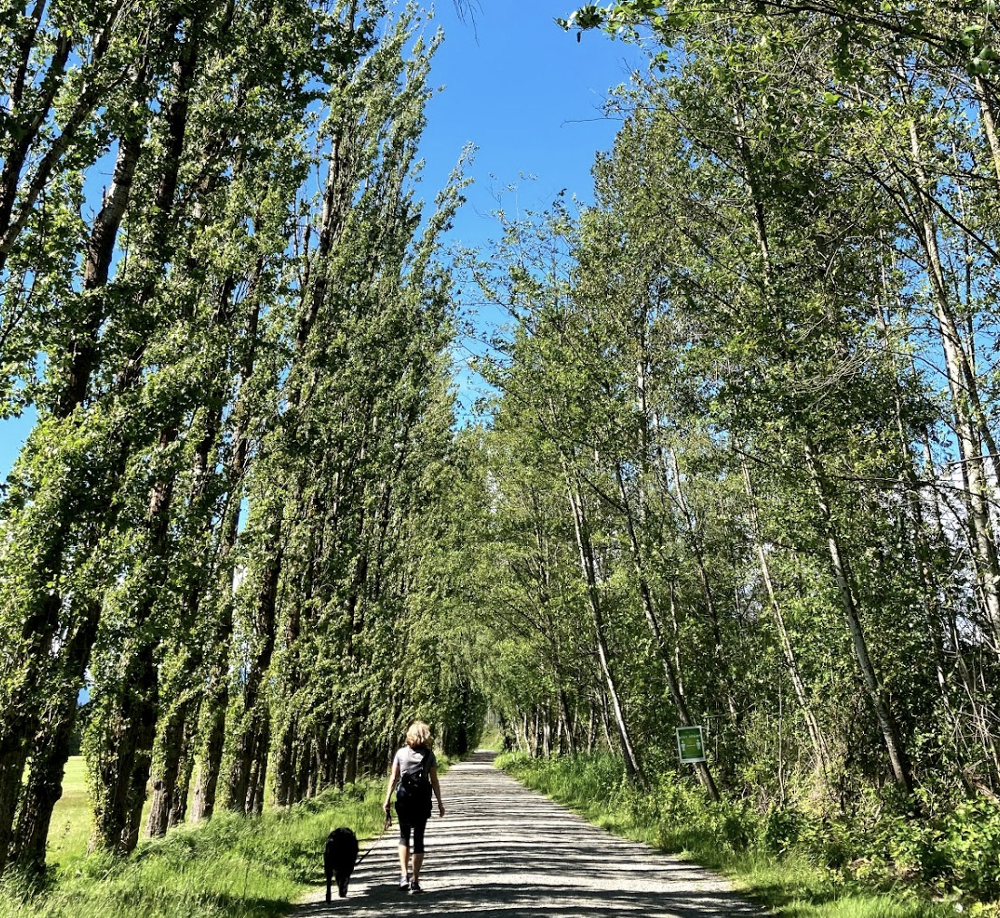
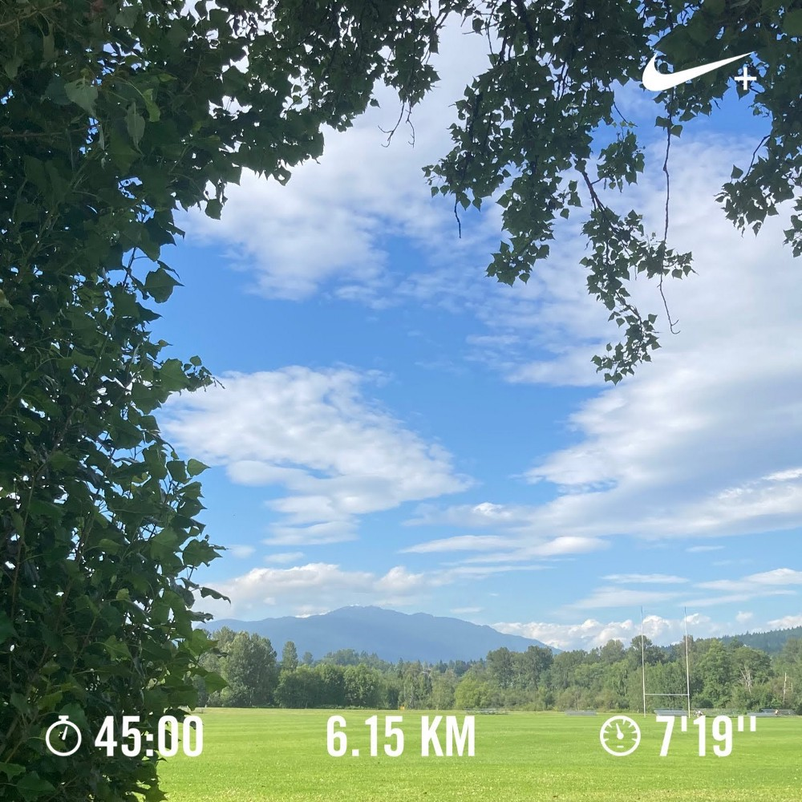

I completed my first 10 km run a few weeks ago and it felt awesome! I felt so good, I decided to write this while I was running, and I began listing the things I wanted to share with you in my mind. I remember wishing I could record my thoughts for later. I sat down to write, and what I ended up writing did little justice to how I felt. Soon I was asking myself, I’m only an amateur writer/ runner who would want to read this? But here goes an overdue short story.

>I'm always excited to run down this long path with the alternating sunshine and shade.

Wednesday, June 3rd, 2020. A notification discretely declares today is Global Running Day. Dismiss. It had been a long day at work (working from home for the record), I was mentally exhausted, and I eagerly logged off and made my way to the park. That day I gave no thought about how far I should run or how long I should run — but I knew I had to run. 1 km into the run I decided the weather was perfect for a longer run and I had no urgent tasks that day so why not run a 10 km?

The longest run I had previously done was an 8k — and that was a long time ago. I ran with a smile that day. Perhaps it was the weather gorgeously overcast and humid, or my playlist, or the freedom that comes with no expectation of a specific pace, time or distance, or the sense of gratitude to be outdoors in a beautiful place, or just the coffee earlier that day — perhaps it was all of these. I was running a new trail. I wanted to know how far my body can go on an easy run. I told myself I will try my best to run easy for as long as I can — because running easy can be hard — I’ll try my best to complete 10 km even if I run slowly and if I find I cannot go on, I will be kind to myself and stop. At the end of that 10 km run, even though I was panting heavily, I felt more energetic than when I started and I was proud of my latest achievement. I let myself entertain the thought of a half marathon — wild, I know!

>A 45 min long guided run I completed.

Sometimes I like running to guided runs on the NRC app because coach Chris Bennet drops some valuable comments to think about while you run. Sometimes his comments have the perfect timing and alignment with what I was telling myself — it seems uncanny — that I have laughed out loud while running.

I believe running has taught me a couple of lessons. And here is one lesson I think we might need to be reminded of every now and then. You can plan in great detail for a perfect run. You can plan the timing of your pre-run meal, you can check the weather, and spend an obscene length of time curating a playlist. And it might still not be the run you were hoping for. Sometimes you might feel anxious, or begin to feel a cramp, or the weather just won’t cooperate. Try approaching each run like a painter approaches a blank canvas. We come to the run prepared with our gear in the same way a painter comes to the canvas prepared with his tools — and then we give it our best. Let the run unfold. By doing this we avoid projecting our expectations of a previous great run which only serves to distract us from the present run. So instead of getting caught up in your thoughts, it is far better to take a deep breath and find the success in the run you can run.

>***Can you find the success in the run you can do?***

