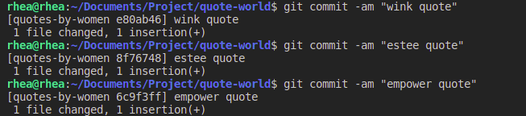

>Not the squash we will perform with git.

I’ve used Git for the past few years now. Albeit only locally for version control. This summer I started working on a remote internship. And, you guessed it, we use Git and GitHub. For me, this opened the door to collaborative aspects of Git and GitHub.

Sometimes I go on a commit frenzy. Especially on bigger feature branches. When I open a Pull Request on GitHub, all the commits I’ve made are displayed there. I imagine it would be unnecessary and no fun for code reviewers to view all the commits. Too many commits might also mess up the Git history. A neat way to solve this mess is to squash the commits into a single commit.

>
> Let’s Git down to business to defeat the bugs

I have an existing Git repository called Quote-World that I’ll use here. In addition to the master branch, I created a new branch called quotes-by-women.

>Repository with the master branch and the quotes-by-women branch

On the quotes-by-women branch, I added the first quote and committed it, added a second quote and committed it and finally added the third quote and committed it. Essentially, I now have 3 commits on this branch. This can translate to working on a feature branch and committing each time you’re satisfied with the changes in the files.

Next, I pushed the quotes-by-women branch to GitHub.

>Pushed commits to GitHub

At this point, you can squash all the commits into a single commit, before you Open a Pull Request. On your terminal, you want to run the following commands

As a good practice, the first thing to do is to go to the master branch and type: git pull --rebase. This command pulls all of the remote repository’s work into your local repository, so we have the latest changes (that someone else might have pushed in the time being).

Next, we switch to the quotes-by-women branch with, git checkout quotes-by-women. Then type: git rebase master. If you got the same message as I did, “Current branch quotes-by-women is up to date” (see screenshot below) it means that you created your branch from the latest changes that are on the master branch.

> Just a quick note to remember: When you create a new branch, always create it from the master branch.

Now you type: git rebase -i master. This command with additional “-i” opens the editor that shows your commits, “-i” means “interactive”. We can see the 3 commits as the first 3 lines in the editor. Also, read the Commands (in blue) listed in the editor very carefully.

>The editor in interactive mode displays all the commits and explains the commands.

The commits are displayed in chronological order from top to bottom. On the first line is the first commit ever made and you can make a decision to use that commit, and squash the others into this first commit. And that is what I will do here. If you read the Commands (in blue), you would know that this means you leave the word “pick” near the first commit, and change the word “pick” near the second and third commits to “fixup”. “Fixup” means the same thing as “squash”, but it will discard the commit’s message, so you will have only one message.

>Replaced ”pick” by “fixup” for second and third commit.

Save this file and close the editor. You should see this message.

At this point, the local branch has a single commit while the remote branch (on GitHub) still has 3 commits. If you open the editor in interactive mode once again, you will see a single commit, with the message of the first commit.

To push this to the remote type: git push -f, “-f” means force. We use “-f” because Git does not let you push directly if there is different work on the remote and local branches.

Once we push this local branch (with a single commit) to the remote (on GitHub), then the remote will automatically display 1 commit instead of 3 commits.

>GitHub now shows 2 commits.

To sum up, this single commit was created by squashing 3 commits. This makes it simple for the person reviewing the Pull Request and helps to maintain a neat Git history on huge projects.

If you found this helpful don’t forget to bookmark it. And if you got questions feel free to get in touch with me.