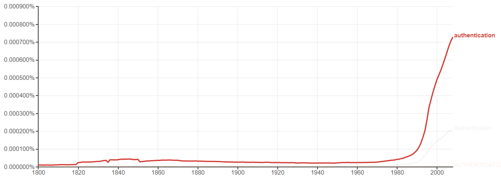
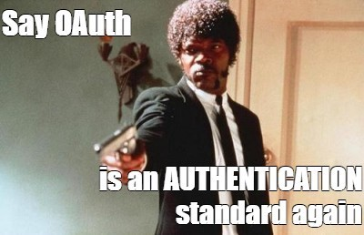

>Perhaps the explosion of the internet circa 2000 is indicative of the surge in the usage of the word ‘authentication’ during that same time as shown in the Google Trends graph.

For a user to have access to these services they would have to first enter into the web application. And this entrance was facilitated by means of a Simple Login. For example, to login to your account on a website you would have to enter your Username and Password into a Web Form. The Web Server would then check the entered Username and Password against a Database. If the password matches, the Web Browser is given a session ID associated with that user’s account. This is authentication. In other words, it is the process of verifying oneself so that the system can confirm that you are what you say you are.

A similar sounding and frequently confused term is another security process called authorization. It is the process of giving the user permission to access specific resources or services. Once the user is successfully authenticated (that means the user has entered the web application) the system must decide what parts of the web application the user can access. In secure environments authorization must always follow authentication*.

>Authentication determines ‘Who you are?’ and Authorization determines ‘What you can do?’

### The problem
Say that some third-party application wanted to send invites to your contacts using the contacts already on your email account. The implementation for this was first attempted by ‘Yelp’. Yelp wanted access to users’ contacts to send out invitation emails to their contacts. For the lack of a better way to do this (at the time), Yelp essentially asked users for the credentials to their Email accounts, then logged into the user’s email account, sent out emails to their contacts and then logged out and threw away the credentials. This implementation gives the third-party application unfettered access to users’ email accounts which most likely hold sensitive personal data.

### Delegated Authorization to the rescue
With the dawn of Facebook and the iPhone in 2007, a use-case known as ‘Delegated Authorization’ became popular. Applications began presenting users with the following prompt: “XYZ application is trying to access your Facebook profile and display picture but it won’t post to Facebook”. This approach is preferred over Yelp’s approach, because authentication and authorization are not violated. Here, the user them self is logged into Facebook and not the third-party application, in this . Furthermore authorization i.e. permission to access the user’s contacts still belongs only to the user, and the user may decide to delegate (or share) the access to a specific resource (like the profile picture or contacts) with the third-party application.

But how is ‘Delegated Authorization’ implemented you ask?

#### Using the OAuth protocol!
(Note: OAuth 1.0 is now deprecated and is rarely used. All mentions of OAuth below are references to OAuth2.0)

Authorization with OAuth (Open Authorization)
The OAuth protocol was designed to solve the “Delegated Authorization” use-case. According to OAuth, access to a user’s information doesn’t have to be all or nothing. There is no need to provide an application with access to all resources when it needs only a single resource (like contact information).

For example, when a user clicks the button on an Application that says, “Connect with your Facebook Account”, the user is put into an OAuth Flow. This is a series of steps that results in the application being able to access only the required resources, that the user has explicitly consented access to. OAuth was designed to solve the Authorization problem i.e. it is concerned with scopes and permissions. It is not concerned with user identity or ‘who you are’ i.e. Authentication.

A new problem, Authentication with OAuth?

>OAuth (Open Authorization) was not built for Authentication.

OAuth became so widespread that it came to be used for Authentication. Google (and Facebook and the like) began providing the “Sign in with Google” alternative when a user wanted to Sign-Up for a new account on a website. This was a bad idea because OAuth was not designed for Authentication. To make up for the missing functionality to perform Authentication, Google and Facebook added their own custom hacks to OAuth. The problem was that these custom implementations of OAuth were not inter-operable, and hence there was no standardization.

### OpenID Connect to the rescue
OpenID extends the functionality of the existing OAuth protocol to include Authentication by adding a layer on top of it. More specifically OpenID Connect performs a Federated Authentication, which is the ability to login to a site using an existing Google (or Facebook) account.

#### In Conclusion
This brief article was inspired by this youtube video. If you made it to this point, I would encourage you to watch that video for a deeper understanding of the working of OAuth flow, SAML, and OpenID connect.

*An exception use-case would be a blog where anonymous users can comment on a blog post. Here the user is authorized to comment even though the user has not been authenticated.