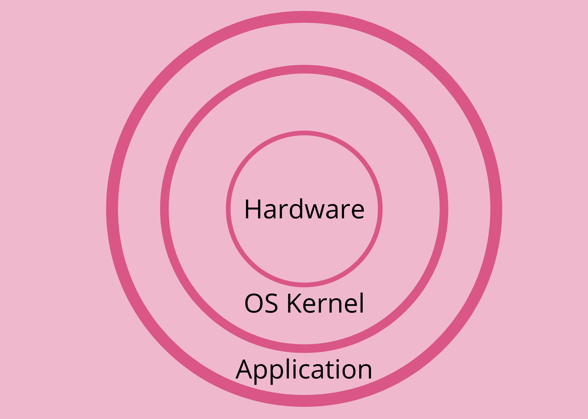
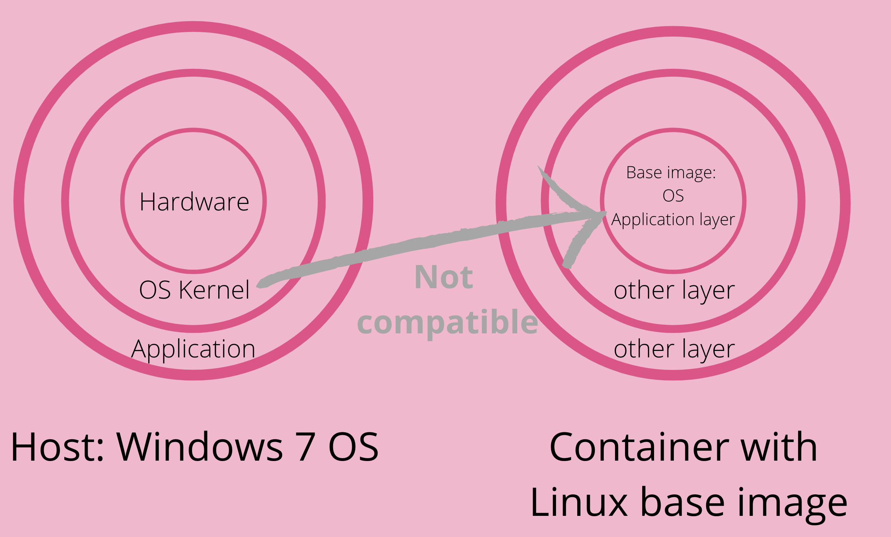

Let's quickly look at how the Operating System (OS) is organized. At a high level, an OS can be thought of as having two layers sitting over the hardware layer. The OS Kernel sits over the hardware layer to enable communication with the hardware components like CPU or memory. The Application layer sits on top of this OS Kernel.

> There are a large number of Linux OS flavors (Ubuntu, Debian, Alpine, etc). They all share the same Kernel layer i.e. the Linux Kernel remains the same. But each of them has a different file system and GUI because the implementation of the application layer is different.

# Virtual Machine vs Container
A VM and a container are both virtualization tools but they virtualize different parts of the host OS. 

- A **container virtualizes the Application layer only** and uses the host's Kernel layer. So a container only has an Application layer (and possibly other layers stacked on top of that). But it does not include the Kernel layer.

- The VM has the Application layer as well as the Kernel layer. Thus, the **VM virtualizes the entire OS**. The VM instance will fire up its Kernel instead of using the host's Kernel layer.

Since the VM and container virtualize different parts of the OS, they differ on features like size, speed, and compatibility.

1. Size: Containers are smaller than VM since they don't include the Kernel layer.
2. Speed: Containers are faster to start running. The VM takes longer because it has to fire up its Kernel layer in addition to the Application layer.
3. Compatibility: It is straightforward to run a VM of any kind of OS on any other host OS. The same is not true with containers. 
    - For example, a Linux-based container image might not run on a host with a Windows OS (This is true for hosts with Windows versions < 10 and older macOS versions). The Windows Kernel layer on the host is not compatible with the container's Linux-based Application layer.
    > 
    - If the host OS Kernel is not compatible with the container there are tools (like Docker Toolbox/ Docker Desktop) to work around this problem. The tool abstracts the host's Kernel layer which makes it possible to run the container images.

|VM|Container|
|--|--|
|Abstracts at the OS Kernel level over the hardware layer on the host.|Abstracts at the Application Layer which packages code and dependencies.|
|Multiple VMs can run on the same host. Each VM has the entire copy of the OS, application and dependencies.|Multiple containers can run on the same host while sharing the same host OS Kernel resources.|
|Take up larger space and slower to start.|Take up lesser space and are quicker to start.|

